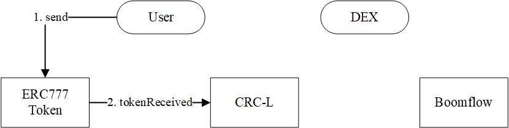
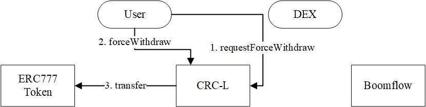
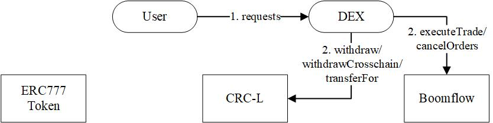
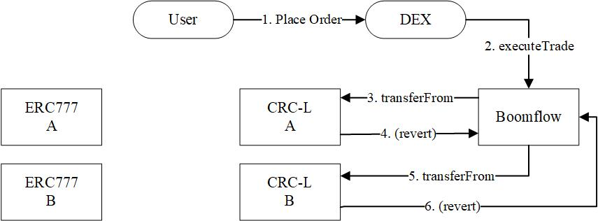

[](https://travis-ci.com/zimengpan/boomflow-contract)

# Boomflow 1.0 specification

## Table of contents

1.  [Architecture](#architecture)
1.  [Contracts](#contracts)
    1.  [Boomflow](#boomflow)
    1.  [CRC-L](#crcl)
1.  [Contract Interactions](#contract-interactions)
    1.  [Deposit](#deposit)
    1.  [Force Withdraw](#force-withdraw)
    1.  [User Requests](#user-requests)
    1.  [Trade Settlement](#trade-settlement)
1.  [Orders & Requests](#orders)
    1.  [Message format](#message-format)
    1.  [Hashing](#hashing)
    1.  [Creating an order/request](#creating-an-order-request)
    1.  [Matching orders](#matching-orders)
    1.  [Instant Exchange](#instant-exchange)
    1.  [Cancelling orders](#cancelling-orders)
    1.  [Querying state of an order](#querying-state-of-an-order)
1.  [Signatures](#signatures)
    1.  [Validating signatures](#validating-signatures)
    1.  [Signature types](#signature-types)
1.  [Events](#events)
    1.  [Exchange events](#exchange-events)
1.  [Types](#types)
1.  [Standard Errors](#errors)
1.  [Miscellaneous](#miscellaneous)
    1.  [EIP-712 usage](#eip-712-usage)
    1.  [Rounding errors](#rounding-errors)

# Architecture

The decentralized portion of Conflux DEX consists of two parts: CRC-L and Boomflow.

[`CRC Lock`](#crcl) (CRC-L) is the token standard of all actual traded assets on DEX, which are bijectively mapped to and from each nominal traded ERC20/ERC777 assets. Besides allowing customers to directly deposit and/or forcibly withdraw between a traded asset and its paired CRC-L, CRC-L places restrictions on operations, such as `transfer` and `transferFrom`, to enforce certain expectations of DEX, allowing DEX to provide efficient and highly available matching services.

Inspired by 0x protocol, which is known as **off-chain order relay with on-chain settlement**, [`Boomflow`](#boomflow)'s approach is **off-chain matching with on-chain settlement**. In this approach, cryptographically signed [orders](#orders) and [requests](#orders) are constructed locally and submitted to centralized matching engine; after the orders and requests are serailized and matched, the trades are passed on to Boomflow contract to execute and settle directly to the blockchain.

# Contracts

## Boomflow

The `Boomflow` contract is the decentralized extension of Conflux DEX. Generally it is not directly available to the public. To DEX, it contains core business logics for:

1.  Validating [signatures](#signatures)
1.  Executing [trades](#matching-orders)
1.  Executing [Instant Exchange](#instant-exchange)
1.  Canceling [orders](#orders)

## CRC-L

The [`CRC-L`](#crcl) contracts are token standard of all actual traded assets on DEX; "**L**" stands for "**Lock**", which highlights the many restrictions enforced by the standard. Note that CRC-L is also registered as ERC777 Tokens Recipient via ERC1820.

In order to opt-in to using DEX service, users must typically deposit to the traded asset's associated [`CRC-L`](#crcl) to transfer the asset on their behalf.

All [`CRC-L`](#crcl) contracts have the following public interface:
```solidity
pragma solidity ^0.5.5;

interface ICRCL {
    function totalSupply() external view returns (uint256);
    function balanceOf(address account) external view returns (uint256);
    function getTokenAddress() external view returns (address);

    function requestForceWithdraw() external returns (bool);
    function forceWithdraw(address recipient) external returns (bool);

    event Transfer(address indexed sender, address indexed recipient, uint256 value);
    event Deposit(address indexed sender, address indexed recipient, uint256 value);
    event Withdraw(address indexed sender, address indexed recipient, uint256 value);
}
```
In addition, CRC-L also contains the following DEX Admin interface that requires user-signed messages:
```solidity
function transferFor(TransferRequest memory request, bytes memory signature) public onlyWhitelistAdmin whenNotPaused returns (bool);
function withdraw(WithdrawRequest memory request, bytes memory signature) public onlyWhitelistAdmin whenNotPaused returns (bool);
function withdrawCrossChain(WithdrawCrossChainRequest memory request, bytes memory signature) public onlyWhitelistAdmin whenNotPaused returns (bool);

```
Finally, it has the following Boomflow interface:
```solidity
function transferFrom(address sender, address recipient, uint256 amount) public onlyWhitelisted whenNotPaused returns (bool);
```
To rationalize the restrictions, consider what the DEX platform is not:
1. It is not a depository platform, and therefore it should not temprarily hold any user assets upfront
1. It is not open orderbook strategy, and therefore it should provide centralized, high available matching service

As a result, CRC-L tokens act as if buffer zones between centralized DEX opertaions and decentralzied user operations: user have the flexibilty to deposit/withdraw in and out of CRC-L, whereas only DEX has the functionalties to maneuver tokens within CRC-L on behalf of the users.

# Contract Interactions

The diagrams provided below demonstrate interactions between various ERC777, CRC-L and Boomflow smart contracts.

There are two versions of Boomflow Javascript SDKs (Broswer and Node) to facilitate the set of user operations both with DEX and with smart contracts.

## Deposit

In order to place orders, users have to deposit balances into CRC-L by sending owned ERC777 token to the corresponding CRCL token address via `send`. Upon receiving the ERC777, CRC-L triggers the ERC777 Token Recipient `tokenReceived` method to mint equal amount of CRC-L to the recipient.

>Note that in `ERC777.send(recipient, amount, data)`, `recipient` is the CRC-L contract address, while `data` is the actual recipient user address.

### ERC777 <> CRCL

<div style="text-align: center;">

</div>

Workflow

1. `ERC777.send(to, amount, data)`
1. `CRCL.tokensReceived(operator, from, to, amount, userData, operatorData)`
1.  CRCLToken: (revert on failure)

## Force Withdraw

Despite the normal withdraw process, users could forcibly withdraw balances from CRC-L to ERC777 token without DEX in place. Force withdraw is largely the reverse process of [`Deposit`](#Deposit), but the major difference is that it requries two transactions instead of one. First, `requestForceWithdraw` is called to record the request time of the sender address; after a certain delay of time, `forceWithdraw` is called from the same sender address to burn CRCL balances and transfer the ERC777 balances in the CRCL address to the recipient.

>You could find the exact delay of time of a CRCL by calling `deferTime()` method.

>Note that `forceWithdraw` should never be called in the routine workflow; it withdraws all balances of the sender address in CRC-L.

### CRCL <> ERC777

<div style="text-align: center;">

</div>

Workflow

1. `ICRCL.requestForceWithdraw()`
1. `ICRCL.forceWithdraw(to)`
1. `IERC777.transfer(to, amount)`
1. CRCLToken: (revert on failure)

## User Requests

For placing/cancelling orders and withdrawing/transferring CRCL, the access to these smart contract functionalities are limited to DEX administrator but require cryptographically signed [orders](#orders) and [requests](#orders) to complete the transaction. In this way, DEX could acknowledge and serialize all the transactions before executing on blockchain.

### DEX

<div style="text-align: center;">

</div>

## Trade settlement

In normal cases, DEX initiates a trade by passing one maker order and one taker order into the [`Boomflow`](#boomflow) contract. If both [orders](#orders) are valid, the [`Boomflow`](#boomflow) contract attempts to first calculate the filled results for each account including fees, and then settle each leg of the trade by calling into the appropriate [`CRC-L`](#crcl) contract for each asset being exchanged.

### ERC777 <> ERC777

<div style="text-align: center;">

</div>

Workflow

1. Place Order
1.  `Boomflow.executeTrade(makerOrder,takerOrder,makerSignature,takerSignature,matcherFeeAddress)`
1.  `ICRCL.transferFrom(from, to, amount)`
1.  CRCLToken: (revert on failure)
1.  `ICRCL.transferFrom(from, to, amount)`
1.  CRCLToken: (revert on failure)
1. Boomflow: (return `matchedFillResults`)

## Matcher fees

<del>Every individual fill executed through the `Boomflow` contract charges a protocol fee to the taker that is used to incentivize liquidity provision in the system.</del>

# Orders & Requests

## Message format

### Orders
An order message consists of the following parameters:

| Parameter | Type | Description |
| -- | -- | -- |
| userAddress | address | Address that created the order. |
| amount | uint256 | Amount available to trade. |
| price | uint256 | Price to trade at. Nonzero for and only for Limit orders |
| orderType | uint256 | Type of the order. |
| side | bool | True for Buy orders; false for Sell orders |
| salt| uint256 | Arbitrary number for uniqueness of the order hash. Currently it is the system time at the construction moment |
| baseAssetAddress | address | Token address of the base asset. |
| quoteAssetAddress | address | Token address of the quote asset. |
| feeAddress | address | Address to accept any fees generated by this order |
| makerFeePercentage | uint256 | Fractions of the total filled amount to charge if the order is matched as maker order |
| takerFeePercentage | uint256 | Fractions of the total filled amount to charge if the order is matched as taker order |

### Requests

#### Boomflow
Cancel Request message consists of the following parameters:

| Parameter | Type | Description |
| -- | -- | -- |
| order | Order | Order that is about to cancel. |
| nonce | uint256 | Arbitrary number for uniqueness of the request hash. Currently it is the system time at the construction moment |

>Note that the cancel request has to be signed by the same address that created the order.

#### CRCL
Withdraw Request message consists of the following parameters:

| Parameter | Type | Description |
| -- | -- | -- |
| userAddress | address | Address that created the request. |
| amount | uint256 | Amount available to trade. |
| recipient | address | Recipient of the withdrawn balances in ERC777 |
| burn | bool | Always false. |
| nonce | uint256 | Arbitrary number for uniqueness of the request hash. Currently it is the system time at the construction moment |

Crosschain Withdraw Request message consists of the following parameters:

| Parameter | Type | Description |
| -- | -- | -- |
| userAddress | address | Address that created the request. |
| amount | uint256 | Amount available to trade. |
| recipient | string | Recipient of the withdrawn balances in crosschain asset. Note that it is of string type to be compatible with addresses in different blockchains |
| defiRelayer | address | contract address that can receive token. |
| fee | uint256 | fee for crosschain |
| nonce | uint256 | Arbitrary number for uniqueness of the request hash. Currently it is the system time at the construction moment |

Transfer Request message consists of the following parameters:

| Parameter | Type | Description |
| -- | -- | -- |
| userAddress | address | Address that created the request. |
| amounts | uint256[] | List of amounts to transfer. |
| recipients | address[] | List of recipients to transfer to; it should be one-to-one correspondance with `amounts` |
| nonce | uint256 | Arbitrary number for uniqueness of the request hash. Currently it is the system time at the construction moment |

## Hashing

The hash of an order/request is used as a unique identifier of that order/request. An order/request is hashed according to the [EIP-712 specification](#https://github.com/ethereum/EIPs/pull/712/files). See the [EIP-712 Usage](#eip-712-usage) section for information on how to calculate the required domain separator for hashing an order/request.

### Orders

```solidity
// EIP191 header for EIP712 prefix
string constant internal EIP191_HEADER = "\x19\x01";

bytes32 constant EIP712_ORDER_SCHEMA_HASH = keccak256(abi.encodePacked(
    "Order(",
    "address userAddress,",
    "uint256 amount,",
    "uint256 price,",
    "uint256 orderType,",
    "bool side,",
    "uint256 salt,",
    "address baseAssetAddress,",
    "address quoteAssetAddress,",
    "address feeAddress,",
    "uint256 makerFeePercentage,",
    "uint256 takerFeePercentage",
    ")"
));

bytes32 orderStructHash = keccak256(abi.encode(
    EIP712_ORDER_SCHEMA_HASH,
    order.userAddress,
    order.amount,
    order.price,
    order.orderType,
    order.side,
    order.salt,
    order.baseAssetAddress,
    order.quoteAssetAddress,
    order.feeAddress,
    order.makerFeePercentage,
    order.takerFeePercentage
));

bytes32 orderHash = keccak256(abi.encodePacked(
    EIP191_HEADER,
    EIP712_DOMAIN_HASH,
    orderStructHash
));
```

### Requests

#### Boomflow
```solidity
bytes32 constant REQUEST_TYPEHASH = keccak256(abi.encodePacked(
    "CancelRequest(",
    "Order order,",
    "uint256 nonce",
    ")",
    "Order(",
    "address userAddress,",
    "uint256 amount,",
    "uint256 price,",
    "uint256 orderType,",
    "bool side,",
    "uint256 salt,",
    "address baseAssetAddress,",
    "address quoteAssetAddress,",
    "address feeAddress,",
    "uint256 makerFeePercentage,",
    "uint256 takerFeePercentage",
    ")"
));

bytes32 requestStructHash = keccak256(abi.encode(
    REQUEST_TYPEHASH,
    REQUEST_TYPEHASH,
    hashOrder(request.order),
    request.nonce
));

bytes32 requestHash = keccak256(abi.encodePacked(
    EIP191_HEADER,
    EIP712_DOMAIN_HASH,
    requestStructHash
));
```

#### CRCL
Withdraw Request:
```solidity
bytes32 constant REQUEST_TYPEHASH = keccak256(abi.encodePacked(
    "WithdrawRequest(",
    "address userAddress,",
    "uint256 amount,",
    "address recipient,",
    "bool burn,",
    "uint256 nonce",
    ")"
));

bytes32 requestStructHash = keccak256(abi.encode(
    REQUEST_TYPEHASH,
    request.userAddress,
    request.amount,
    request.recipient,
    request.burn,
    request.nonce
));
```

Crosschain Withdraw Request:
```solidity
bytes32 constant REQUEST_TYPEHASH = keccak256(abi.encodePacked(
    "WithdrawRequest(",
    "address userAddress,",
    "uint256 amount,",
    "string recipient,",
    "address defiRelayer,",
    "uint256 fee,",
    "uint256 nonce",
    ")"
));

bytes32 requestStructHash = keccak256(abi.encode(
    REQUEST_TYPEHASH,
    request.userAddress,
    request.amount,
    keccak256(abi.encodePacked(request.recipient)),
    request.address,
    request.fee,
    request.nonce
));
```

Transfer Request:
```solidity
bytes32 constant REQUEST_TYPEHASH = keccak256(abi.encodePacked(
    "TransferRequest(",
    "address userAddress,",
    "uint256[] amounts,",
    "address[] recipients,",
    "uint256 nonce",
    ")"
));

bytes32 requestStructHash = keccak256(abi.encode(
    REQUEST_TYPEHASH,
    request.userAddress,
    keccak256(abi.encodePacked(request.amounts)),
    keccak256(abi.encodePacked(request.recipients)),
    request.nonce
));
```

#### CRCL
Withdraw Request message consists of the following parameters:

| Parameter | Type | Description |
| -- | -- | -- |
| userAddress | address | Address that created the request. |
| amount | uint256 | Amount available to trade. |
| recipient | address | Recipient of the withdrawn balances in ERC777 |
| burn | bool | Always false. |
| nonce | uint256 | Arbitrary number for uniqueness of the request hash. Currently it is the system time at the construction moment |

Crosschain Withdraw Request message consists of the following parameters:

| Parameter | Type | Description |
| -- | -- | -- |
| userAddress | address | Address that created the request. |
| amount | uint256 | Amount available to trade. |
| recipient | string | Recipient of the withdrawn balances in crosschain asset. Note that it is of string type to be compatible with addresses in different blockchains |
| defiRelayer | address | contract address that can receive token. |
| fee | uint256 | fee for crosschain |
| nonce | uint256 | Arbitrary number for uniqueness of the request hash. Currently it is the system time at the construction moment |

Transfer Request message consists of the following parameters:

| Parameter | Type | Description |
| -- | -- | -- |
| userAddress | address | Address that created the request. |
| amounts | uint256[] | List of amounts to transfer. |
| recipients | address[] | List of recipients to transfer to; it should be one-to-one correspondance with `amounts` |
| nonce | uint256 | Arbitrary number for uniqueness of the request hash. Currently it is the system time at the construction moment |

## Creating an order/request

An order/request may only be submitted to DEX if it can be paired with an associated valid signature. An order/request hash must be signed with the [SDK](#sdk).

## Matching orders

In normal cases, DEX submits one maker order and one taker order every time a trade is created off-chain.

The maker and taker orders can only be matched together if they are of the same traded asset pairs but opposite order sides:

1. `makerOrder.baseAssetAddress == takerOrder.baseAssetAddress`
1. `makerOrder.quoteAssetAddress == takerOrder.quoteAssetAddress`
1. `makerOrder.side != takerOrder.side`

In other words, the 2 orders must represent a bid and an ask for the _exactly_ same asset pair.

### executeTrade

`executeTrade` atomically executes and settles 2 orders in one transaction. After a successful match, each fee address specified the respective orders will receive the fractions of the order's filled amount.

```solidity
/**
* Execute the exchange between a maker order and a taker order.
* Only Whitelistlisted (DEX) have the access permission.
*
* The function will atomically perform the following operations:
*
*      1. Validate both taker order, maker order and the match
*      2. Calculate the matching results
*      3. Settle the exchanges
*/
function executeTrade(
    Order memory makerOrder,
    Order memory takerOrder,
    bytes memory makerSignature,
    bytes memory takerSignature,
    address feeAddress
)
    public
    onlyWhitelisted
    whenNotPaused
    nonReentrant
    returns (LibFillResults.MatchedFillResults memory matchedFillResults)
```

#### Logic

Calling `executeTrade` will perform the following steps:

1. Set the `baseAssetAddress` of the taker order to the `baseAssetAddress` of the maker order
1. Set the `quoteAssetAddress` of the taker order to the `quoteAssetAddress` of the maker order
1. Query the state and status of both orders
1. Revert if either order is unfillable (invalid context, invalid amount, invalid price, cancelled, fully filled, invalid signature)
1. Revert if both orders are limit type but do not have a negative spread
1. Calculate the [`MatchedFillResults`](#matchedfillresults) at the price point of the _maker_ order
1. Update the state and log a [`Fill`](#fill) event for each order
1. Transfer `matchedFillResults.takerFillAmount` of `takerFillAsset` from maker to taker
1. Transfer `matchedFillResults.makerFillAmount` of `makerFillAsset` from taker to maker
1. Transfer `matchedFillResults.takerFee` of `takerFillAsset` from maker to taker
1. Transfer `matchedFillResults.makerFee` of `makerFillAsset` from taker to maker

Note that there will always be [rounding errors](#rounding-errors).

## Instant Exchange

In order to buy/sell a specified amount of an asset, DEX might fill a market taker order with multiple maker orders while guaranteeing that no individual fill throws an error. However, if the entire amount is not sold then the call will revert.

>Currently, this functionality only available to "BTC-FC" asset pairs, as this pair does not have a dedicated matching engine in DEX; rather, there are only "BTC-USDT" and "USDT-FC" pairs availabel. As a result, in order for users to exchange BTC with/for FC, the `executeInstantExchangeTrade` also have to calcualte the matched fill results in two roundtrips to first convert order amounts to the intermediate "USDT".

### executeInstantExchangeTrade

`executeInstantExchangeTrade` can be used to either buy or sell a specified amount of "FC" with "BTC" by filling multiple orders while guaranteeing that no individual fill throws an error. This function enforces that the length of base and quote makerOrder lists should be either both zero or both nonzero; in other words, the function could only function after `recordInstantExchangeOrders` is called for the same taker order.

```solidity
/**
* Execute all the recorded base maker orders and quote maker orders for a specific taker order.
* The function should be called after `recordInstantExchangeOrders`
* Only Whitelistlisted (DEX) have the access permission.
*
* The function will atomically perform the following operations:
*
*      1. Impersonate a taker order between the taker-owned asset and intermediate asset
*      2. Calculate the results for the first exchange roundtrip
*      3. Impersonate another taker order between intermediate asset the taker-asked asset
*      4. Calculate the results for the second exchange roundtrip
*      5. Settle all the exchanges
*
* Requirements:
* - The length of base and quote makerOrder lists should be either both zero or both nonzero
* - The amount of intermediate asset left after the second exchange roundtrip should be less than `threshold`
*/
function executeInstantExchangeTrade(
    Order memory takerOrder,
    bytes memory takerSignature,
    uint256 threshold
)
    public
    onlyWhitelisted
    whenNotPaused
    nonReentrant
```

#### Logic

Assume that there are three assets:
1. Owned Asset, which is owned by taker
2. Asked Asset, which is wanted by taker
3. Intermediate Asset, which is the overlapping asset that traded with both Owned and Asked Asset on DEX

Calling `executeInstantExchangeTrade` will perform the following steps:

1. Query the list of stored base and quote maker orders of `takerOrder`
1. Impersonate a taker order that exchange between the owned asset and intermediate asset
1. Calculate the [`MatchedMarketFillResults`](#matchedmarketfillresults) at the price point of each _base maker_ order in a roundtrip
1. Impersonate a taker order that exchange between the intermediate asset and the asked asset
1. Calculate the [`MatchedMarketFillResults`](#matchedmarketfillresults) at the price point of each _quote maker_ order in a roundtrip.
1. Update the state and log a [`Fill`](#fill) event for taker order
1. Sequentially, update the state and log a [`Fill`](#fill) event and settle for maker orders

## Cancelling orders

Orders can be permanently invalidated on-chain by using any of the following cancellation functions.

### cancelOrder

`cancelOrder` cancels the specified order with user-signed request. Partial cancels are not allowed.

```solidity
/**
* Cancel an order with user-signed request.
* Only Whitelistlisted (DEX) have the access permission.
*
* The function will cancel a single order
*/
function cancelOrder(CancelRequest memory request, bytes memory signature)
    public
    onlyWhitelisted
    whenNotPaused
```

#### Logic

Calling `cancelOrder` will perform the following steps:

1. Validate the signature of the cancel request
1. Revert if the function is called with an invalid signature
1. Update the state of the order

### cancelOrders

`cancelOrders` can be used to cancel a batch of orders with a batch of user-signed request in a single call.

```solidity
/**
* Cancel orders in batches.
* Only Whitelistlisted (DEX) have the access permission.
*
* The function will iteratively cancel each order specified
*/
function cancelOrders(CancelRequest[] memory requests, bytes[] memory signatures)
    public
    onlyWhitelisted
    whenNotPaused
```

#### Logic

Calling `cancelOrders` will sequentially call `cancelOrder` for each element of `orders`.

### finalizeOrder

`finalizeOrder` is used to cancel an orders without user-signed request.

```solidity
/**
* Cancel an order without user-signed request.
* Only Whitelistlisted (DEX) have the access permission.
*
* The function will cancel a single order when DEX decides that there are
* no more matching orders available
*/
function finalizeOrder(Order memory order, bytes memory signature)
    public
    onlyWhitelisted
    whenNotPaused
```

#### Logic

Calling `finalizeOrder` will perform the following steps:

1. Validate the signature of the order
1. Revert if the function is called with an invalid signature
1. Update the state of the order

>Note that it might seem unreasonablly powerful to let DEX arbitrarily decides to terminate an order without user-signed request; yet since there is no way for smart contracts alone to judge whether an order should be cancelled due to lack of matched orders, both users and Boomflow have to rely on DEX's knowledge.

## Querying state of an order

### filled

The Boomflow contract contains a mapping that records the nominal amount of an order's `amount` that has already been filled. This mapping is updated each time an order is successfully filled, allowing for partial fills.
```solidity
// Mapping of orderHash => amount of baseAsset already sold by user; for Market Buy, it is in amount of quoteAsset
mapping (bytes32 => uint256) public filled;
```

### max

The Boomflow contract contains a mapping that records the maximal amount of an order's `amount`. This mapping should only be updated once when first seen in the smart contract.
```solidity
// Mapping of orderHash => max amount of baseAsset from user; for Market Buy, it is in amount of quoteAsset
mapping (bytes32 => uint256) public max;
```

### cancelled

The Boomflow contract contains a mapping that records if an order has been cancelled.

```solidity
// Mapping of orderHash => cancelled
mapping (bytes32 => bool) public cancelled;
```

### baseMakerOrders

For Instant Exchange, the Boomflow contract contains a mapping that records the all base maker orders of an taker order. This map entry is updated every time new base maker orders added by `recordInstantExchangeOrders`; the entry is cleaned up after `executeInstantExchangeTrade`.

```solidity
// Mapping of orderHash => all instantExchange base orders
mapping (bytes32 => Order[]) baseMakerOrders;
```

### quoteMakerOrders

For Instant Exchange, the Boomflow contract contains a mapping that records the all quote maker orders of an taker order. This map entry is updated every time new quote maker orders added by `recordInstantExchangeOrders`; the entry is cleaned up after `executeInstantExchangeTrade`.

```solidity
// Mapping of orderHash => all instantExchange quote orders
mapping (bytes32 => Order[]) quoteMakerOrders;
```

### getOrderInfo

`getOrderInfo` is a public method that returns the state, hash, and amount of an order that has already been filled as an [OrderInfo](#orderinfo) instance:

```solidity
/// @dev Gets information about an order: status, hash, and amount filled.
/// @param order Order to gather information on.
/// @return OrderInfo Information about the order and its state.
///         See LibOrder.OrderInfo for a complete description.
function getOrderInfo(LibOrder.Order memory order)
    public
    view
    returns (LibOrder.OrderInfo memory orderInfo);
```

# Signatures

## Validating signatures

Both `Boomflow` and `CRCL` contracts includes one public methods for validating signatures:

### isValidSignature

`isValidSignature` can be used to verify all signatures.

```solidity
function isValidSignature(
    bytes32 hash,
    address signerAddress,
    bytes memory signature
)
    public
    pure
    returns (bool isValid)
```

## Signature Types

All signatures submitted to the `Boomflow` contract are represented as a byte array of arbitrary length. The only supported signature type is EIP712.

### EIP712

An `EIP712` signature is considered valid if the address recovered from calling [`ecrecover`](#ecrecover-usage) with the given hash and decoded `v`, `r`, `s` values is the same as the specified signer. In this case, the signature is encoded in the following way:

| Offset | Length | Contents            |
| ------ | ------ | ------------------- |
| 0x00   | 1      | v (always 27 or 28) |
| 0x01   | 32     | r                   |
| 0x21   | 32     | s                   |

# Events

## Exchange events

### Fill

A `Fill` event is emitted when an order is filled.

```soldiity
event Fill(
    address indexed userAddress,        // Address that created the order.
    uint256 amount,                     // Amount in base asset
    uint256 price,                      // Price per base asset
    OrderType orderType,                // Type of the order
    bool side,                          // Buy or Sell
    address baseAssetAddress,           // Base asset token address
    address quoteAssetAddress,          // Quote asset token address
    bytes32 orderHash,                  // Order's hash
    uint256 fee,                        // Fee order creator to pay
    address feeAddress,                 // Address to pay fee
    address matcherAddress,             // DEX operator that submitted the order
    uint256 tradeAmount                 // Total amount traded
);
```

# Types

### Order

```solidity
struct Order {
    address userAddress;                // Address that created the order.
    uint256 amount;
    uint256 price;
    uint256 orderType;                  // 0 is Limit, 1 is Market
    bool side;                          // Buy side is true
    uint256 salt;                       // Arbitrary number to facilitate uniqueness of the order's hash.
    address baseAssetAddress;           // Encoded data that can be decoded by a specified proxy contract when transferring makerAsset. The last byte references the id of this proxy.
    address quoteAssetAddress;          // Encoded data that can be decoded by a specified proxy contract when transferring takerAsset. The last byte references the id of this proxy.
    address feeAddress;
    uint256 makerFeePercentage;
    uint256 takerFeePercentage;
}
```

### MatchedFillResults

```solidity
struct MatchedFillResults {
        uint256 tradeAmount;
        uint256 tradeFunds;
        uint256 makerFillAmount;
        uint256 takerFillAmount;
        uint256 makerFee;
        uint256 takerFee;
}
```

### MatchedMarketFillResults (For Instant Exchange)

```solidity
struct MatchedMarketFillResults {
        MatchedFillResults[] fillResults;
        uint256 totalMakerFill;
        uint256 totalTakerFill;
        uint256 totalTradeAmount;
        uint256 totalTradeFunds;
        uint256 totalTakerFee;
}
```

### OrderInfo

```solidity
struct OrderInfo {
    uint8 orderStatus;          // Status that describes order's validity and fillability.
    bytes32 orderHash;          // EIP712 hash of the order.
    uint256 filledAmount;       // Amount of order that has already been filled.
}
```

# Standard Errors

## OrderStatusError

```solidity
enum OrderStatus {
     INVALID,
    INVALID_AMOUNT,
    INVALID_PRICE,
    FILLABLE,
    EXPIRED,
    FULLY_FILLED,
    CANCELLED,
    INVALID_TYPE
}
```

# Miscellaneous

## EIP-712 usage

Hashes of orders and requests are calculated according to the [EIP-712 specification](https://github.com/ethereum/EIPs/pull/712/files).

The domain hash for the `Boomflow` and each `CRC-L` contract can be calculated with:

```solidity
bytes32 constant internal EIP712_DOMAIN_SEPARATOR_SCHEMA_HASH = keccak256(abi.encodePacked(
    "EIP712Domain(",
    "string name,",
    "string version,",
    "uint256 chainId,",
    "address verifyingContract",
    ")"
));

// EIP712 Exchange Domain Name value
string constant internal EIP712_EXCHANGE_DOMAIN_NAME = "Boomflow"; // or "CRCL"

// EIP712 Exchange Domain Version value
string constant internal EIP712_EXCHANGE_DOMAIN_VERSION = "1.0";

bytes32 EIP712_EXCHANGE_DOMAIN_HASH = keccak256(abi.encodePacked(
    EIP712_DOMAIN_SEPARATOR_SCHEMA_HASH,
    keccak256(bytes("Boomflow")),
    keccak256(bytes("1.0")),
    chainId,
    bytes32(address(this))
));
```

For more information about how this is used, see [hashing an order](#hashing-an-order) and [hashing a request](#hashing-a-request).

## Rounding errors

Doing any sort of division in the EVM may result in rounding errors. `executeTrade` and `executeInstantExchangeTrade` variants does not currently limit the allowed rounding error.